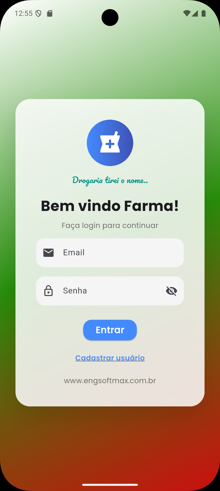
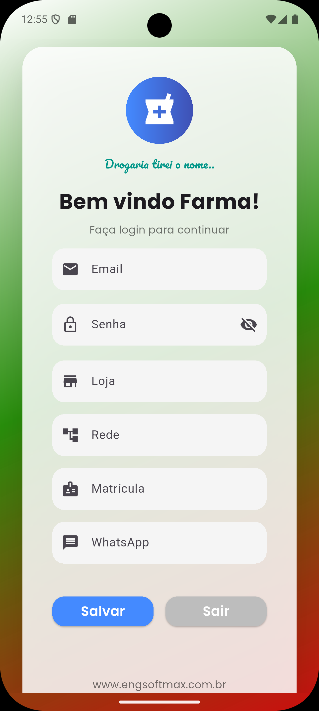

# 💊 Flutter Login UI – Farma App

Tela de login desenvolvida em **Flutter**, com foco em **design moderno, animações suaves e boa experiência do usuário**.  
O projeto foi criado como uma base visual reutilizável para aplicações mobile, especialmente no contexto farmacêutico.

---

## 📱 Preview do Projeto

- Interface moderna com **Material 3**
- Animações de entrada (fade + scale)
- Gradiente customizado
- Ícones e tipografia profissionais
- Alternância entre **Login** e **Cadastro**
- Código limpo e organizado em um único arquivo

> ⚠️ **Observação:**  
> Este projeto é **100% UI/UX**. Não há integração com backend, banco de dados ou autenticação real. No segundo momento será adicionado a conexão.

---

## 🧩 Funcionalidades

- Tela de Login
  - Campo de Email
  - Campo de Senha com visibilidade dinâmica
- Modo Cadastro (toggle)
  - Loja
  - Rede
  - Matrícula
  - WhatsApp
- Feedback visual com `SnackBar`
- Responsivo para diferentes tamanhos de tela

---

## 🎨 Tecnologias Utilizadas

- **Flutter**
- **Material 3**
- **Google Fonts**
- Animações com:
  - `AnimationController`
  - `FadeTransition`
  - `ScaleTransition`
  - `AnimatedSwitcher`
  - `AnimatedSize`

---

## 🧠 Arquitetura do Projeto

- Projeto simples e didático
- Um único arquivo (`main.dart`)
- Separação lógica por métodos privados
- Fácil de evoluir para:
  - Firebase Authentication
  - API REST
  - Controle de sessão
  - Clean Architecture

---

## 🚀 Como Executar

```bash
flutter pub get
flutter run
```

## 📱 Preview do Projeto

<p align="center">
  
  
</p>
